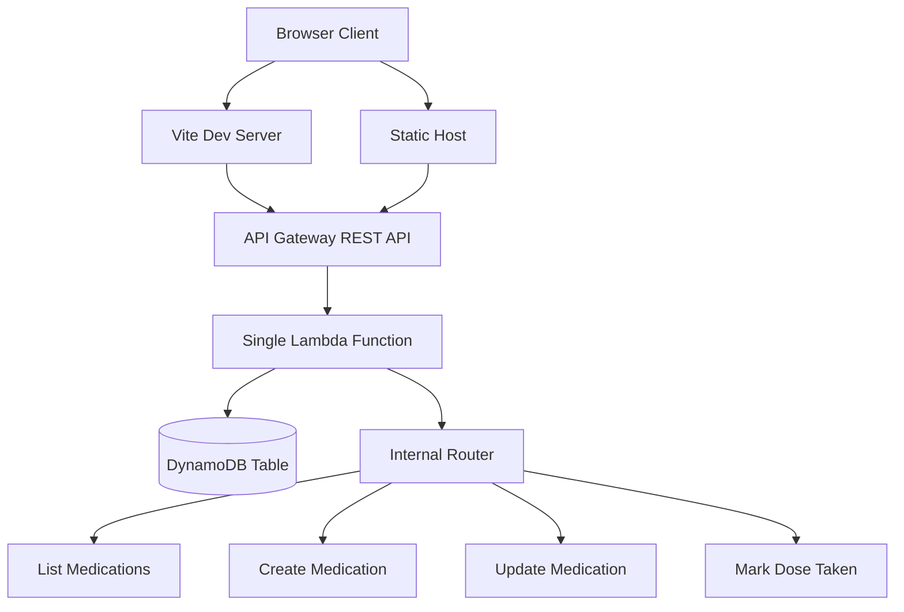

# PillPal - Medication Management App

A fullstack serverless application for managing medications and schedules, built with React, AWS Lambda, API Gateway, and DynamoDB.

## Architecture Overview



## Technology Stack

### Frontend

- **React 18+** with TypeScript
- **Vite** - Build tool and dev server
- **Tailwind CSS** - Utility-first CSS framework
- **React Router** - Client-side routing (if needed)

### Backend

- **AWS Lambda** - Single function handling all routes
- **AWS API Gateway** - REST API endpoint
- **DynamoDB** - NoSQL database for data persistence
- **AWS SDK v3** - DynamoDB operations

### Infrastructure

- **Terraform** - Infrastructure as Code
- **TypeScript** - Type safety across the stack

### Testing

- **Vitest** - Unit and integration testing
- **React Testing Library** - Component testing

### Development Tools

- **ESLint** - Code linting and formatting (via @antfu/eslint-config)

## Prerequisites

- **Node.js** 18+ and npm
- **AWS CLI** configured with credentials
- **Terraform** 1.0+ installed
- **AWS Account** with appropriate permissions
- **Git** for version control

## Quick Start

The easiest way to get started is to use the automated deployment script:

```bash
# Clone the repository
git clone <repository-url>
cd PillPal

# Run the deployment script
./deploy.sh
```

The `deploy.sh` script will:

1. ✅ Check all prerequisites (Node.js, AWS CLI, Terraform)
2. 📦 Install dependencies
3. 🔍 Check code quality (lint and format with ESLint)
4. 🏗️ Build frontend and Lambda function
5. 🧪 Run unit tests
6. 🚀 Deploy infrastructure to AWS using Terraform
7. 📝 Update `.env` file with API Gateway URL

After deployment, simply run `npm run dev` to start the frontend dev server.

## Manual Setup Instructions

If you prefer to run the steps manually or need more control:

### 1. Clone and Install

```bash
git clone <repository-url>
cd PillPal
npm install
```

### 2. Configure AWS

Ensure your AWS credentials are configured:

```bash
aws configure
```

This will set up credentials in `~/.aws/credentials` and `~/.aws/config`.

**Note:** The region in `terraform/variables.tf` (default: `us-east-1`) can be customized.

Alternatively, you can set environment variables:

```bash
export AWS_ACCESS_KEY_ID=your-key
export AWS_SECRET_ACCESS_KEY=your-secret
export AWS_REGION=us-east-1
```

### 3. Build the Application

```bash
# Build frontend
npm run build

# Build Lambda function
npm run build:lambda
```

### 4. Deploy Infrastructure with Terraform

```bash
cd terraform
terraform init
terraform plan
terraform apply
```

After deployment, Terraform will output the API Gateway URL.

### 5. Configure Environment Variables

Create a `.env` file in the root directory:

```env
VITE_API_URL=<api-gateway-url-from-terraform-output>
```

Or get the URL from Terraform:

```bash
cd terraform
terraform output api_gateway_url
```

### 6. Start Development Server

```bash
npm run dev
```

The frontend will be available at `http://localhost:5173`

## Project Structure

```
PillPal/
├── src/                    # React frontend source
│   ├── components/         # React components
│   ├── lib/                # Utilities and API client
│   ├── types/              # TypeScript types
│   └── main.tsx            # Vite entry point
├── functions/              # Lambda function
│   ├── api.ts              # Single Lambda handler with router
│   └── lib/                # Shared Lambda utilities
│       ├── dynamodb.ts     # DynamoDB client wrapper
│       └── router.ts       # Simple request router
├── terraform/              # Terraform infrastructure
│   ├── main.tf             # Main infrastructure resources
│   ├── variables.tf        # Input variables
│   ├── outputs.tf          # Output values
│   └── provider.tf         # Provider configuration
├── __tests__/              # Vitest unit tests
├── deploy.sh               # Automated deployment script
├── vite.config.ts          # Vite configuration
└── package.json            # Dependencies and scripts
```